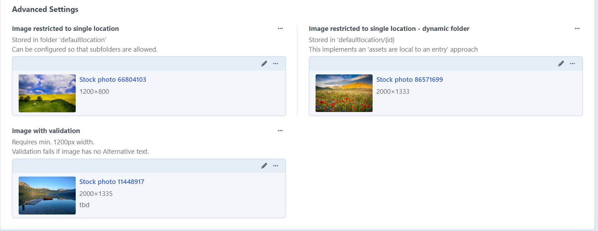
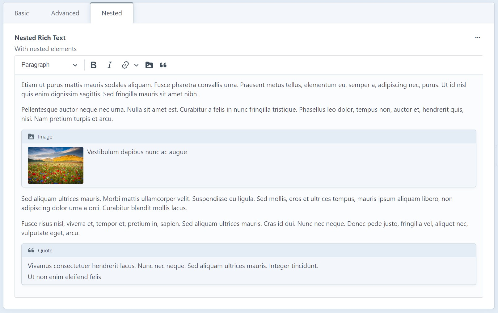
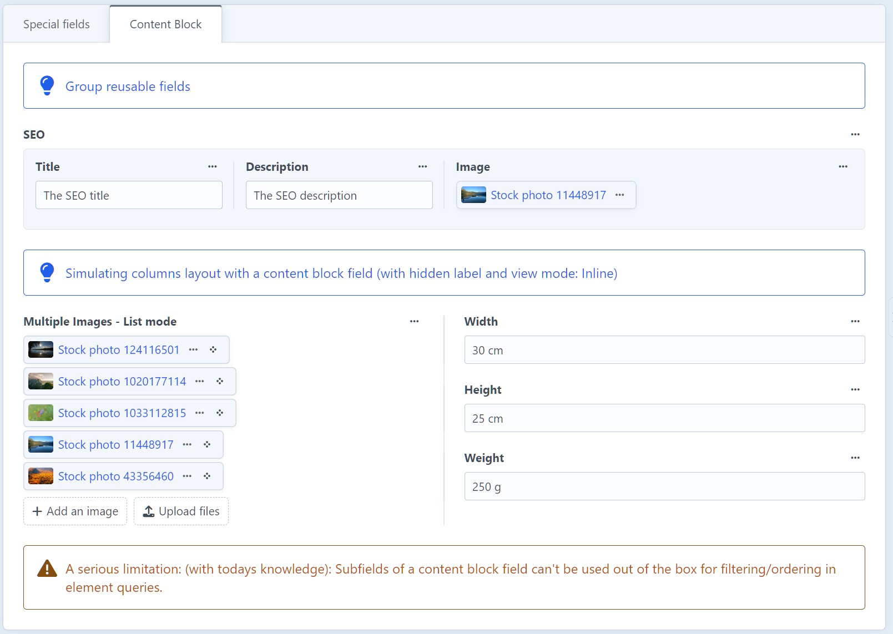

# Craft 5 Kitchen Sink

A Craft CMS 5 project with a focus on demonstrating various field types and settings.

Created as part of a master's thesis on content modeling in the context of various content management systems, especially field types/complex content types and their settings as building blocks for content modeling and a smooth authoring experience/content governance.

May also serve as presentation material for Craft CMS 5, showcasing the capabilities of the system to clients.

Inspired by the kitchen sink example in [Kirby 5 playground](https://github.com/wsydney76/kirby5-playground).

## DDEV Installation

* Clone repository
* `cd` into project directory
* Run `bash setup/install <projectname> <username> <password>` (or follow the included steps manually)

Optionally run `ddev craft db/restore setup/seed.sql.zip` to seed the project with example (nonsense) content.
This will create a user with the credentials `admin/craft5-kitchensink`.

## Screenshots

In case you don't want to set up the project, here are the screenshots:

### Content

### Relations

### Matrix

Using Matrix for repeatable fields, working around the limitations of Craft's native table field

Using Matrix for attributed relationships

Using Matrix for content builder

Nested...

Using Matrix for structured data (e.g. the vita of an actress)

Using Matrix for multi columns layout

### Rich Text

AKA CKEditor first party plugin.

Basic usage - just some formatting

Advanced usage

With nested entries

### Special Fields

